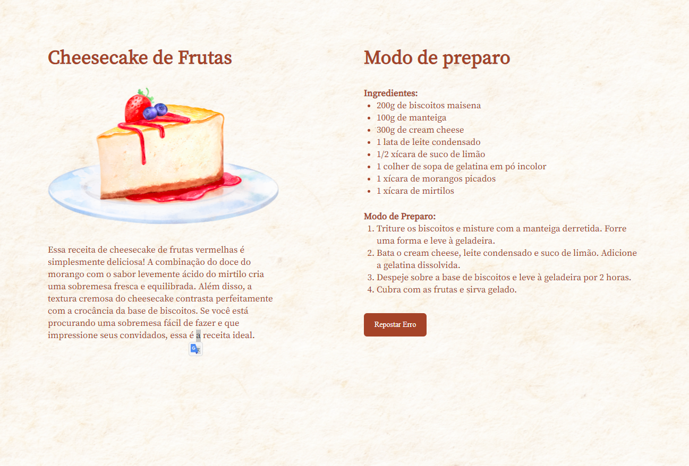

## 💻 Project

This project was developed during Stage 03 classes in Explorer.

  

## 🚀 Technologies

This project was developed with the following technologies:

- HTML
- CSS

---

Done with 💜 by [Rocketseat](https://rocketseat.com.br)

<!--START_SECTION:footer-->

 

  

<!--END_SECTION:footer-->
